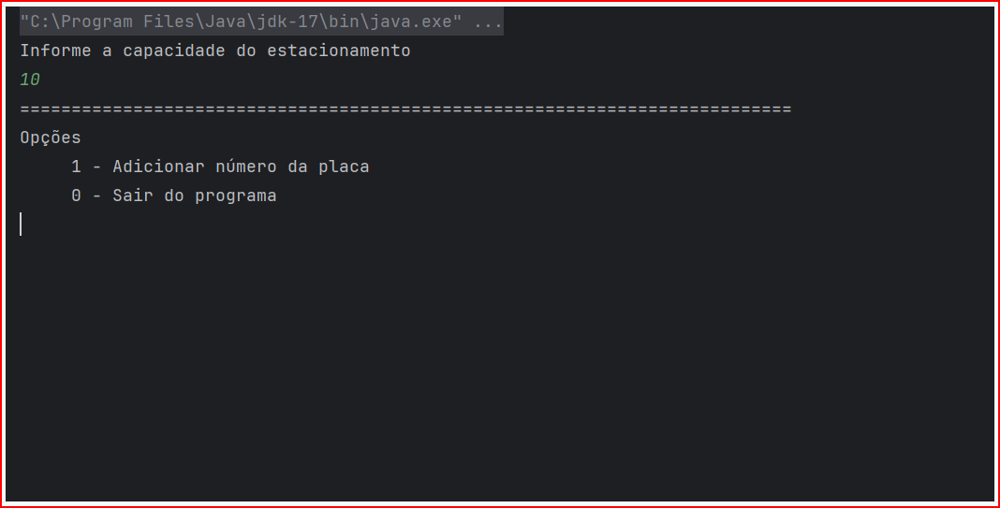
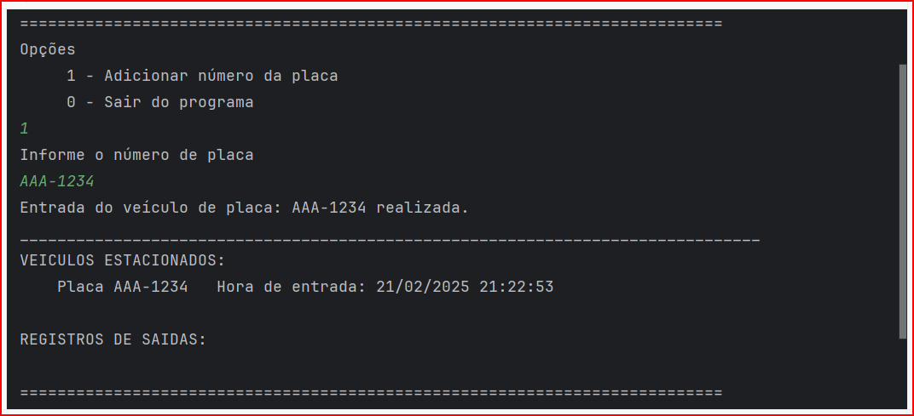
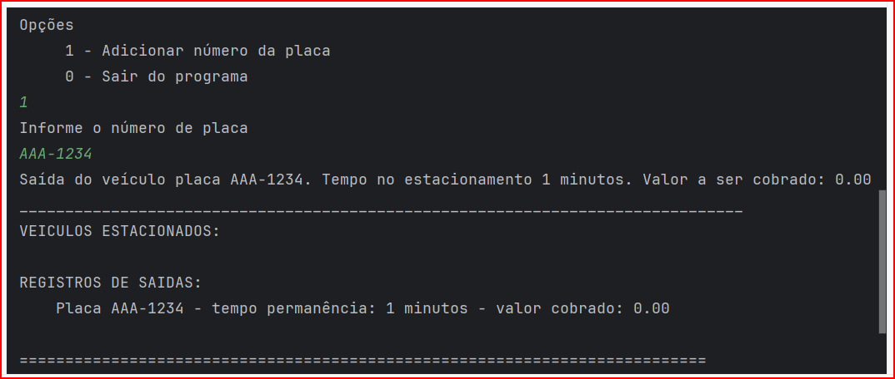
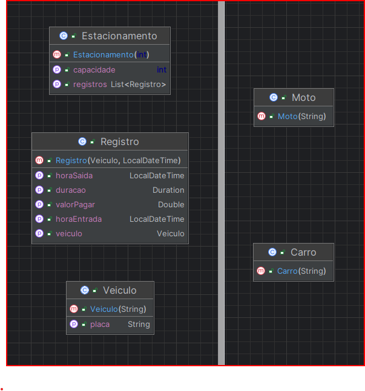

# ADA Estacionamento - Programação Orientada a Objetos

## Descrição
Projeto de estacionamento para a disciplina de Programação Orientada a Objetos.

---
## Objetivo

- Aplicar os conceitos de programação orientada a objetos em um projeto prático.
- Usar classes e objetos para modelar o sistema.
- Usar herança e polimorfismo para criar classes e métodos genéricos.
- Usar encapsulamento para proteger os dados.
- Manipular coleções de objetos usando Streams.
- Ler e interpretar enunciados.

---
## Enunciado

### Requisitos
Criação de um sistema para controlar veículos em um estacionamento. 

O sistema deve ser capaz de:

- Permitir a entrada de veículos no estacionamento
- Permitir a saída de veículos do estacionamento
- Controlar o tempo de permanência de cada veículo no estacionamento
- Controlar a lotação do estacionamento
- Calcular o valor a ser pago pelo cliente baseado no tipo de veículo
- Exibir um relatório com as informações de todos os veículos que passaram pelo estacionamento
- O sistema deve ser capaz de ser extensível para adicionar novos tipos de veículos

### Regras de Negócio

> **RN1** - O estacionamento possui um limite de vagas que deve ser informado no momento da inicialização.

> **RN2** - O estacionamento não deve permitir a entrada de veículos quando estiver lotado.
 
> **RN3** - O estacionamento deve permitir apenas veículos do tipo Carro e Moto.

> **RN4** - O estacionamento possui um valor fixo primeira hora e um valor para cada hora adicional baseado no tipo de veículo.
> - Carro: R$ 5,00 para a primeira hora e R$ 6,00 para hora adicional.
> - Moto: R$ 3,00 para a primeira hora e R$ 4,00 para hora adicional.
>
> 
> **Exemplo de cálculo de valor a ser pago:**
>  
> De 0 a 5 minutos não é cobrado nenhum valor.  
> Acima de 5 minutos é cobrado o valor de uma hora.  
> Acima de 1 hora é cobrado o valor de uma hora e mais o valor da hora adicional.
> 
>  **Exemplo 1:** 1h e 4 minutos = R$ 5,00 (1 hora) + R$ 6,00 (4 minutos) = R$ 11,00.  
>  **Exemplo 2:** 1h e 59 minutos = R% 5,00 (1 horas) + R$ 6,00 (59 minuto) = R$ 11,00.  
>  **Exemplo 3:** 2h e 1 minuto = R$ 5,00 (1 hora) + R$ 6,00 (1 hora) + R$ 6,00 (1 minuto) = R$ 17,00.  
             
### Comportamento

- O sistema deve ser capaz de identificar se o estacionamento está lotado

- Para cada veículo o sistema deve solicitar a placa do veículo e o tipo do veículo

- O sistema deve ser capaz de identificar se o veículo já está no estacionamento

- Para o veiculo que entrar no estacionamento, exibir a mensagem:
    > Entrada do veículo placa: XXX-0000 realizada.

- Para o veiculo que sair do estacionamento, exibir a mensagem:

    > Saída do veículo placa: XXX-0000. Tempo de permanência: X minutos. Valor a pagar: Z,00

- Apos o registro de entrada ou saida de um veículo e após exibir a mensagem correspondente
o sistema deve exibir um relatório com os veículos que estão no estacionamento e os que já saíram.

  > VEÍCULOS ESTACIONADOS:
  > 
  > Placa CCC-1234 	 Hora de entrada: dd/MM/yyyy HH:mm:ss.  
  > Placa AAA-1234 	 Hora de entrada: dd/MM/yyyy HH:mm:ss.
  >   
  > REGISTROS DE SAÍDAS:
  > 
  > Placa BBB-1234 - tempo permanência: X minutos - valor cobrado: X.XX

### Estrutura do Projeto

O projeto deve ser construído em Java usando os conceitos de Programação Orientada a Objetos.  

Aplicar o conceito de herança e polimorfismo para a classe Veiculo, permitindo a criação de novos tipos de veículos sem afetar o que ja está construído.  

O sistema deve exibir um menu com as opções:

    1 - Registrar placa de veículo
    2 - Sair

Para armazenar os dados o sistema deve usar coleções de objetos.  
Para a entrada de dados o sistema deve usar a classe **Scanner**.  
Para controlar de tempo o sistema deve usar a **API java.time do Java**.  
Para o cálculo de valor a ser pago pode se usar a **API java.math do Java**, ou fazer o cálculo manualmente.

### Orientações e sugestões

- O sistema pode ser dividido em tres classes principais: Estacionamento Registro e Veículo. e classes para cada tipo de veículo. 

- A classe Estacionamento deve controlar a entrada e saída de veículos, verificar a lotação do estacionamento e expor dados para o relatório.   

- A classe Registro deve controlar o tempo de permanência e identificar o veículo.  

 
- A classe Veículo deve ser a classe base para os tipos de veículos e deve ser abstrata, contendo um método concreto para calcular o valor a ser pago usando os valores de cada tipo de veículo.  
 
 
- A classe abstrata Veículo deve expor métodos abstratos para identificar o valor da primeira hora e o valor da hora adicional de cada tipo de veículo.  
 
 
- Para cada tipo de veículo deve ser criada uma classe que herda de Veículo e implementa os métodos abstratos.  

### Entrega
O projeto deve ser entregue via LMS em um arquivo compactado com o nome do aluno.

### Demonstração

1

